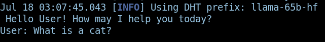
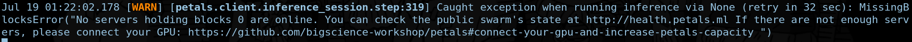

# friendly-goggles
LLM chat app(CLI and very bare bones ofcourse) with Contextual Memory and Some chicky little resources regarding research papers

# Blog Time
So I was getting bored and someone in a group chat mentioned about making an LLM which mimics that human... hmmmmm.. so it seems like it is time to code something up. 
Now what they did was use GPT's API and their data from whatsapp to create a version of themselves which sounds like a good idea. But not good enough for us aha. So I sat down and thought hmmm what can be done to make something cool but simple enough. Brain twinkle-twinkled and what can I say, my brain can think (XD).

So the plan is simple, Make a CLI and very barebones application which has contextual memory (that is, it can remember what you guys were talking about from like 20 messages ago and probably after an year as well if you let the memory persist without deleting it, A good friend for ranting I suppose). Along with contextual memory, I think I'd like to add a way to upload research papers to it so that the LLM can talk with the knowledge of those papers (and probably be able to connect research paper if it has to).

Now each branch will be a feature which gets added along with some blogging cause why not, right? I just thought it would be a cool way to communicate my thoughts before I hopefully start working on making a youtube channel.

## Jul 18 02:22:36 AM
So I tried using LLaMA-cpp, which means that I was planning to run the model locally. We ain't no kids to use OpenAI's GPT API. But well cause I don't have a great CPU and GPU that plan kinda failed soon (we went from tokens per second to minutes per token real quick)
Now what? We shift to petals and try that out. What is petals you might ask? good thing you did, its a decentralized way of running LLMs. Check it out and maybe put your GPU there to make the whole thing faster?! :D
The model of choice was LLaMa-65B but I was getting a validation error for that lad so I switched to Bloom but might get a validation error again. Idk what the F is that time error which it keeps on throwing at me for no reason and it still has 5 mins remaining to download while I update this blog.

## Jul 18 03:07:38 AM
After spending almost an hour to figure out why was I getting the "ValidationError: local time must be less that 3 seconds than others" which didn't make sense at all. I fixed it by installing chrony and enabling ntp (for debian/ubuntu I think you can get away with using ntpdate but who am I to guess that, I use void anyways).

Well now we have the LLaMa-65B model working so lets go! thats progress.
 
what?

## Jul 19 00:22:29 AM
Ello there bois and girls. After a day of pulling my hair at work (I didn't work the whole day) here I am writing this blog again, but fear not, I am sure it won't be a new day for you but instead you would be reading this all in one go. YOU WON'T KNOW ABOUT MY SUFFERINGS AND THE WAIT!! AAAAAAAAAAAAAAAAAAAAAA.

So yesterday I posted this repo on reddit and someone there said "Ey, I gotta learn more about this then I will get what it is" to which I asked "Should I make this shit simpler?". They said "yes please". So u/lolcoder69, this nerdy programmer shall do the same. Hmmm now how do we do that? first I'll start with explaining about what the F is happening in here "tf is petals? aint no flowery lad you are? decentralized way of running LLM? what you the central government!? LLaMA-cpp my butt what?"

Alright alright calm down (as if you guys were getting worked up cause of that XD) I'll explain everything in Ape terms. 

1. First on list is LLaMA-cpp
    - What is this about one might ask? So some extremely smart guy came up with this idea of quantizing a LLaMA model and running it. Now what they were looking for was speeeeeed. They wrote the whole inference method in C++??!?! LIKE FUCKING SMART HUMANS. And this was all hacked in one day (I think they mentioned it in their repo [Check it out here](https://github.com/ggerganov/llama.cpp))
    - Now what this is does is makes running an LLM on your laptop easier (you won't get ChatGPT like speeds but it is workable), and a lighter model (quantized one) means it's gonna run even lighter with not much of loss in the performance. Though you would need a really good GPU for that but we don't have that so fuck this.

2. Now to solve our previous issue of not having a good GPU, I introduce to you [Petals](https://github.com/bigscience-workshop/petals).
    - Some ultra smart human came into the loop and said "Bitches we have decentralized currencies, what if I fed those deadass mining GPUs a wonderful way to run LLMs in a decentralized manner?" and there we go, we have Petals.
    - How it works is pretty simple. Most of the heavy lifting of calculating what the Large Language Model (ie LLM) has to say on other gpus which are in a "swarm". Swarm is basically a group of GPUs which can be used (These are not available for free since someone is willing to let you use them so be grateful to them). The calculation of words is done on your device and there you go, you have an output of words from the supported LLM.

3. Bloom and LLaMA are just different kinds of LLM models which are available to use in the wild. There are more but petals had only these two if I am not wrong. You can setup a swarm for other models but meh I don't have a good gpu to do that so well I will use LLaMA. And what will you do even if I had an option eh? Not like you can come into the screen and hit me in the past. hah Quantum Mechanics doesn't allow time travel ehehehe.

Now that this is out of the way and I hope you understand everything better, I am going to work on allowing the user to have a chit chat witth the model. While I do that, why not give the "star" and "watch" buttons on this repo a little pat pat eh? Would help me out. XD

## Jul 19 01:22:34 AM

I don't know what to do now since LLaMA model on petals seems like it won't work... FUCK... well there goes my bullshitting on you guys from the last update lol. I'll check out which one is available and switch to that one.

Seems like the whole thing is down.. Jesus fucking hell so that means I can't proceed forward with the ML chat. Well thats a wrap then XD

## Jul 20 01:07:01 AM 
Ello there chiky lads and lovely lass, I am fucked today. 
Remember I implemented a local LLM? then switched to Petals cause performance and hardware issues? Well guess what?!?!! AT MY JOB, THEY SAID YOU GOTTA IMPLEMENT LLM ALONG WITH CONTEXTUAL MEMORY! WHICH IS EXACTLY WHAT WE WERE DOING PREVIOUSLY.

So LLM is gonna come back with the template and all of that, and lets add contextual memory to it as well today in the same go. 

What do we do? So its simple from the top, remove petals completely and add an LLaMA-cpp again and add an option to choose which model you want to talk to? that would be nice to have. Then add contextual memory in another branch and not this one. Hmmm sounds good, the model will remember what you guys were talking about (Again better than a fake friend)
